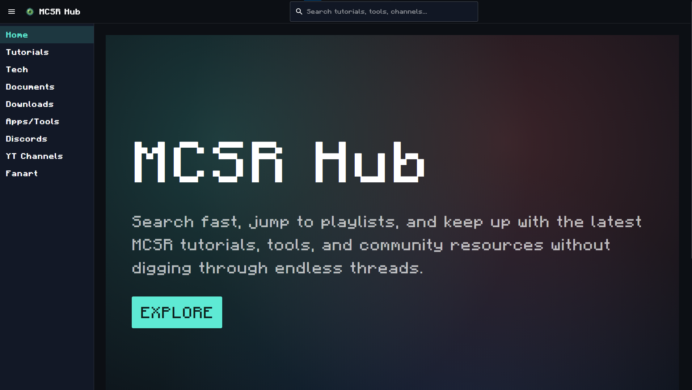

# MCSRHub

<p align="center">
  
</p>

MCSR is such a diversified community of likeminded individuals. There are so many guides, resources, and tutorials out there, but it can take new runners hours of shifting through it to find exactly what they need. So, what if there was a unified hub with all the designated information to provide any runner (old and new alike) with quick references to specific tech and information?

## Contributing

We are always open to contributions to the project. Meant to be community driven, MCSR Hub allows for any one to contribute to make this site the most up-to-date with MCSR tech and resources. If you see anything that you think could be improved, please create an issue and we will look into it.

### Getting Started

Please make sure you have at least [NodeJS v22](https://nodejs.org/en) or greater installed before continuing.

Clone the repository.

```bash
git clone https://github.com/jqhz/MCSRHub.git
```

Next, navigate to the project directory and install the dependencies.

```bash
cd MCSRHub
npm install
```

### Branching

When working on a new feature, please create a new branch with the following naming convention:

```bash
git checkout -b feature/<feature-name>
```

## New Card Suggestions

If you want to add a new card, /dev/content allows you to see all the current cards and to add a new one. If you would like to get a resource added, message me on Discord `@jqhz` or create a pull request.

## Fan Art

With Twitter/X requiring an bearer token to call its API, we were unable to scrape fan art directly from the site. However, if you would like your fan art to be uploaded for free exposure, inquire Discord `@jqhz` with your post and I can add it to the site.

> [!NOTE]
> This method works best for now, but may change due to scalability if too many requests are being made.

Enjoy resource hunting!

